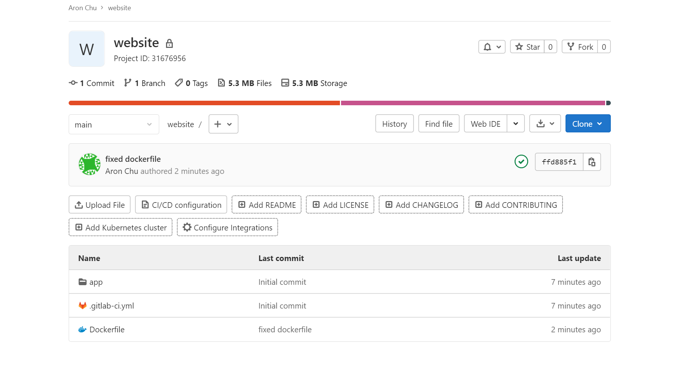
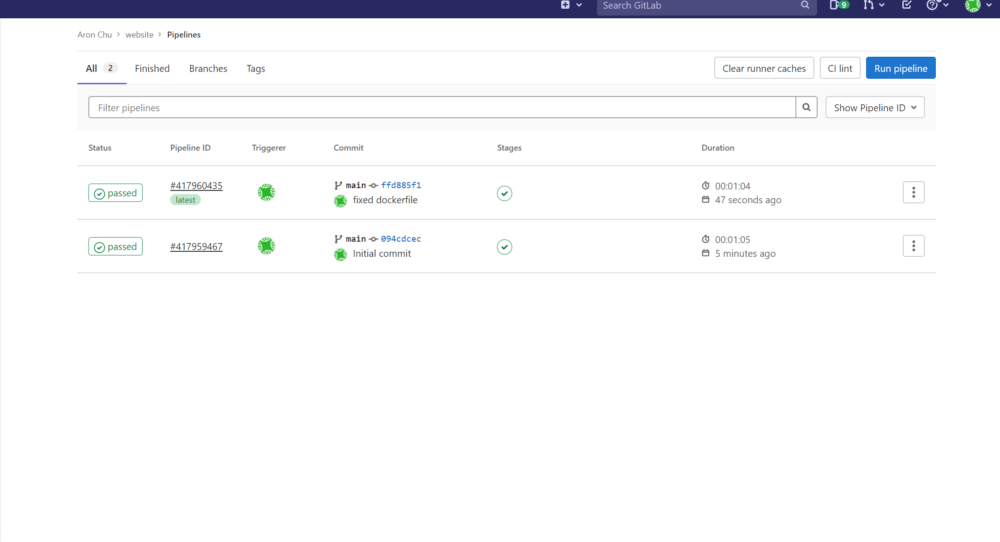

# Personal-Website

- In this project I deployed a website using Terraform to configure Cloudfront, ACM, and S3 resources. *Works on mobile 
- Containerized and created a pipeline using gitlab for continuous integration

Site Link: https://aronblog.net

